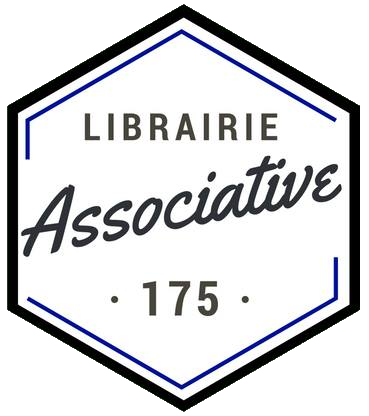

#**librairie**
##**Librairie associative 175**

#Le projet
Le but de ce projet est de réaliser le site web d'une future librairie associative, permettant d'intéragir en ligne avec celle-ci.
Le service permettra en autres de commander des livres, de suivre leur disponibilité et de donner un avis sur ceux-ci.

#Le déroulement
Ce travail est réalisé au cours de notre DUT Informatique, en groupe de 4 étudiants.
Nous prorsuivons donc ce projet, initié l'année dernière par un précédent groupe d'étudiants.
